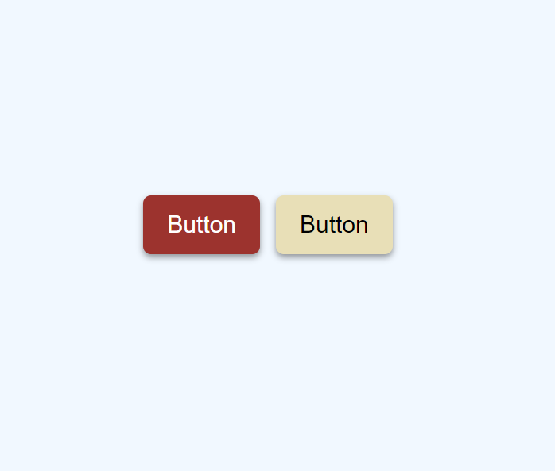

<h1 align="left">10 JavaScript Project</h1>

###

<h3 align="left">Description</h3>

###

On mouse move, the button exhibits a hover effect. The purpose of this project is to obtain the mouse position on the button.

###

<h3 align="left">Screenshot</h3>

###

  

###
