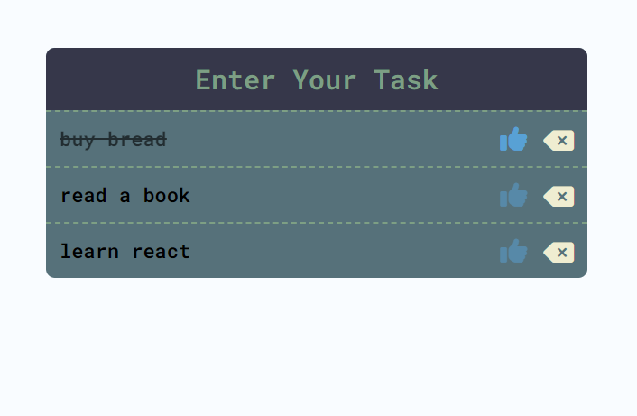

<h1 align="left">10 JavaScript Project</h1>

###

<h3 align="left">Description</h3>

###

This is a to-do list app. When you enter a to-do item, it appears on the screen. The purpose of this project is to retrieve to-do items from a local database and display them on the screen.

###

<h3 align="left">Screenshot</h3>

###

  

###
