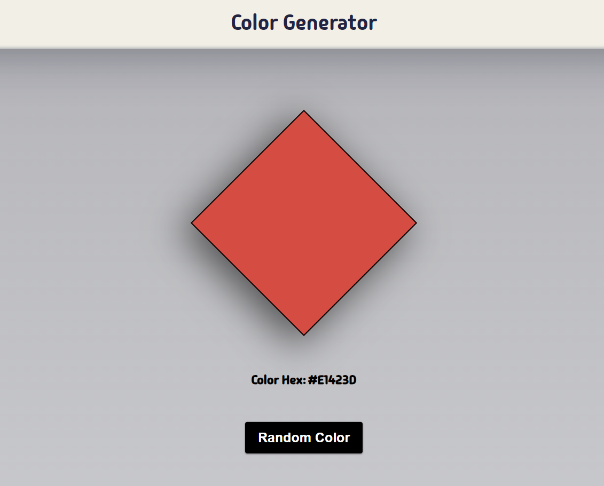

<h1 align="left">10 JavaScript Project</h1>

###

<h3 align="left">Description</h3>

###

When the button is clicked, a box generates a random color. The purpose of this project is to use the random method to select an element from an array and retrieve a color.

###

<h3 align="left">Screenshot</h3>

###

  

###
