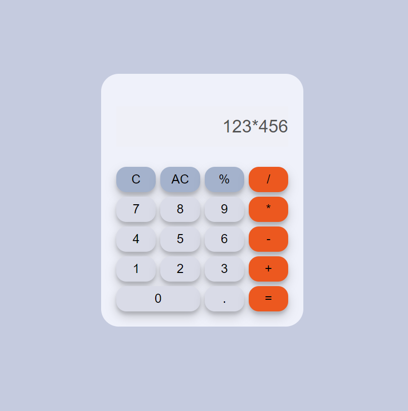

<h1 align="left">10 JavaScript Project</h1>

###

<h3 align="left">Description</h3>

###

This is a calculator project. The purpose of this project is to utilize the eval function to perform mathematical calculations.

###

<h3 align="left">Screenshot</h3>

###

  

###
