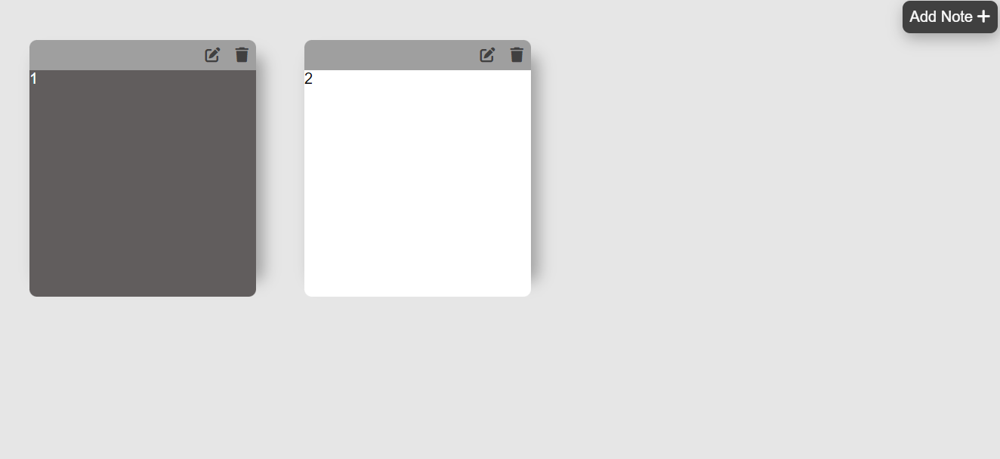

<h1 align="left">10 JavaScript Project</h1>

###

<h3 align="left">Description</h3>

###

This is a notepad app. The purpose of this project is to create note items in HTML code with JavaScript. You can organize these items and store them in local storage.

###

<h3 align="left">Screenshot</h3>

###

  

###
