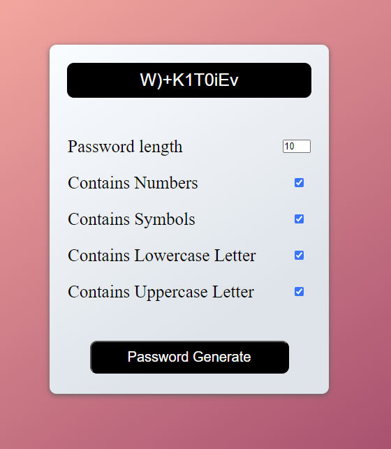

<h1 align="left">10 JavaScript Project</h1>

###

<h3 align="left">Description</h3>

###

This is a password generator. When the button is clicked, it generates a random password. The purpose of this project is to run a function when the checkbox is checked and obtain a random value.

###

<h3 align="left">Screenshot</h3>

###

  

###
